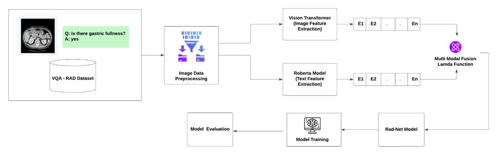

# Multi-modal Transformer Pre-training for Radiology VQA

## 📌 Project Overview
**RAD-NET** is a multimodal deep learning model for **Visual Question Answering (VQA)** in radiology.  
By combining a **Vision Transformer (ViT)** for image feature extraction and **BERT** for text embeddings, RAD-NET can analyze radiology images (X-rays, CT scans, MRIs) and answer medical queries, aiding radiologists in efficient diagnoses.

---

## 🎯 Objective
The primary goal of RAD-NET is to develop an automated VQA system that:
- Helps healthcare professionals gain insights from radiology images.
- Processes **natural language queries**.
- Improves **diagnostic accuracy** and **efficiency**.

---

## 🚀 Features
- **Multimodal Fusion**: Combines image and text data to provide context-aware answers.
- **Text and Image Embedding**: Uses ViT for images and BERT for text to generate high-quality embeddings.
- **Scalability**: Designed to handle multiple medical image types and potentially multiple languages.

---

## 🏗️ Architecture
- **Vision Transformer (ViT)**: Extracts image embeddings from radiology images by dividing them into patches.
- **BERT**: Converts textual queries into embeddings for natural language understanding.
- **Multimodal Fusion**: Fuses image and text embeddings using a Lambda Layer for a combined representation.

---

## ⚙️ Requirements
- **TensorFlow** or **PyTorch** for model training.
- **Hugging Face Transformers** for pre-trained models.
- **Google Colab** / **Kaggle** for cloud-based GPU support.

---

## 📊 Training Details
- **Dataset**: [VQA-RAD dataset](https://osf.io/89kps/) (radiology images with questions and answers)
- **Hyperparameters**:
  - Learning Rate: `1e-5`
  - Batch Size: `32`
  - Epochs: `20`
  - Optimizer: `AdamW`
  - Loss Function: `Cross-entropy`

---

## 📈 Results

| Model Configuration | Train Accuracy | Validation Accuracy |
|---------------------|---------------|---------------------|
| ViT + BERT          | 72.2%         | 58.16%              |
| ViT + RoBERTa       | 70.69%        | 58.87%              |
| ViT + ALBERT        | 70.78%        | 58.21%              |

---

## ⚠️ Challenges
- **Imbalanced Dataset**: Overfitting due to a high proportion of closed-ended (Yes/No) questions.
- **Limited Resources**: High computational demands for deep model training.

---

## 🔮 Future Work
- **Open-Ended Questions**: Extend model capabilities for more complex answers.
- **Explainability**: Enhance model transparency with explainability techniques.
- **Multimodal Data**: Integrate clinical metadata for improved responses.

---

## 📷 Architecture Diagram

